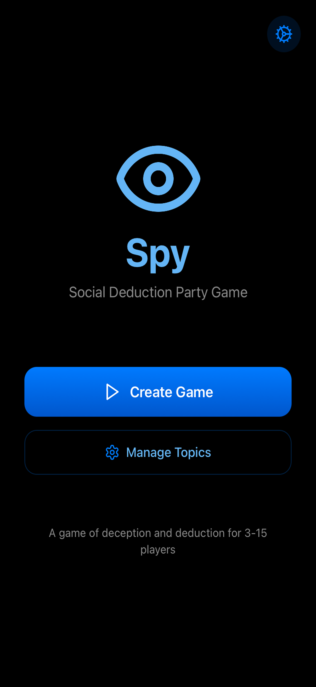
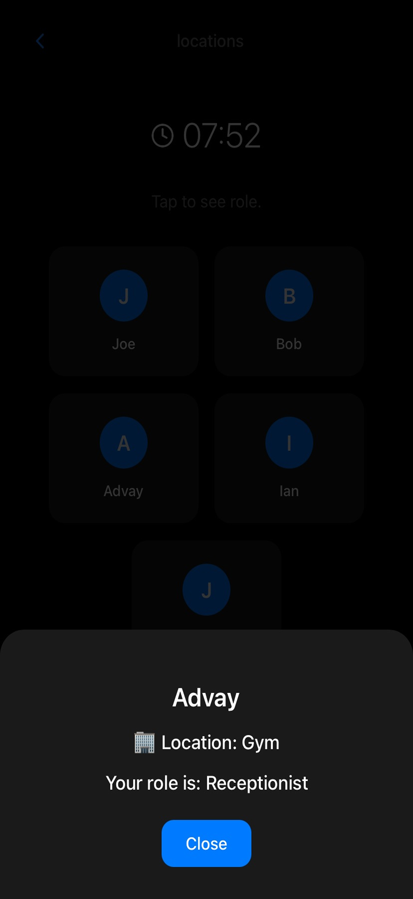
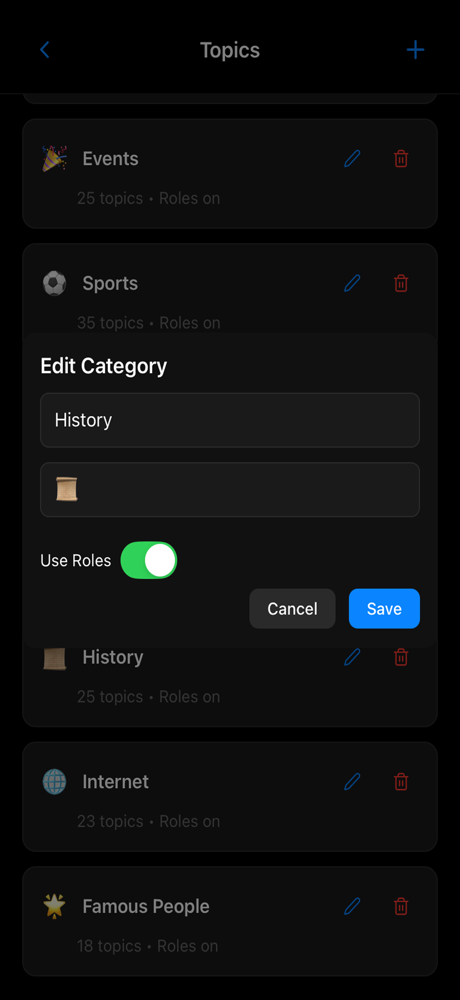
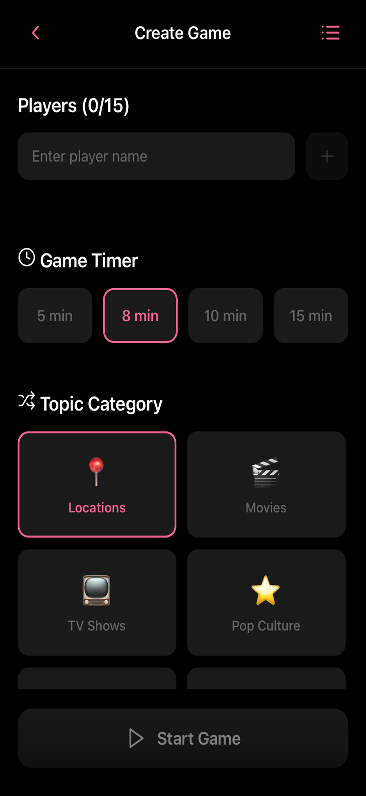
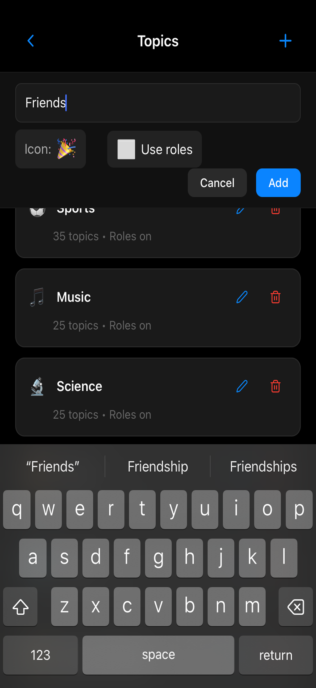

# Spy

Social deduction party game for iOS & android where players uncover hidden roles and outsmart each other to win

---

## Demos
<details>
  <summary>Click to view all demos</summary>

  ### Gameplay GIF
  

  ### Video Demo
  [Watch Demo Video](https://github.com/user-attachments/assets/33248075-c040-43f1-8be8-3578a567a6c6)

  ### Screenshots
  <details>
    <summary>iPad Screenshots</summary>
    
    
    
    
    
    
    
    
    
    
  </details>

  <details>
    <summary>Other Screenshots</summary>
    
    
    
    
    
    
    
    
    
    
  </details>
</details>
---
### Setup

#### 1. install dependencies
```bash
npm install 
```

#### 3. Run locally 
```bash
npx expo start
```

#### 4. Build for iOS/Android

You can build the app using EAS . Make sure you have EAS CLI installed and configured.

- iOS:
  ```bash
  eas build -p ios --profile production
  ```
- Android:
```bash
  eas build -p android --profile production
  ```
Or, you can just run a prebuild to setup the ios and android folders, then build using Xcode or Android Studio:

```bash
npx expo prebuild --clean
```

#### 5. Distribute to App Store
```bash
  eas build -p android --profile production
  ```
Or, you can just run a prebuild to setup the ios and android folders, then build using Xcode or Android Studio:

```bash
npx expo prebuild --clean
```
```bash
npx expo prebuild --clean
```

#### 5. Distribute to App Store

- Open Xcode → Window → Organizer
- Select "Distribute App" → App Store Connect
- Or use Transporter to upload the generated .ipa file

